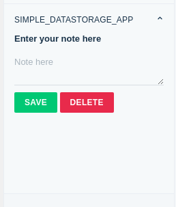

# Simple Data Storage App

### Description:

This app allows you to save a memo linked to the ticket.

### Screenshots:

### Features demonstrated:

1. Data Storage - set, get & delete

### Prerequisites:

1. Make sure you have a trial account created on Freshdesk.
2. Ensure that you have the [Freshworks Developer Kit (FDK)](https://community.developers.freshworks.com/t/installing-the-freshworks-cli/234) installed properly.

### Procedure to run the app:

1. Run the app locally using the [`fdk run`](https://developers.freshchat.com/v2/docs/freshworks-cli/#run) command
2. Append `?dev=true` to the Freshworks product URL to see the changes
